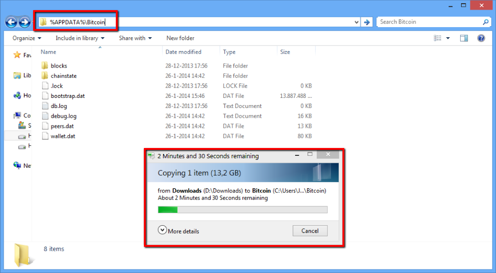
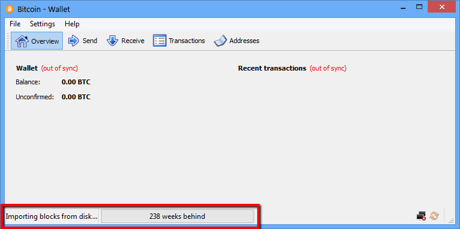

### Bootstrap the Blockchain Synchronization

Normally the Marscoin client will download the transaction and network information, called the blockchain, from the network by syncing with the other clients. This process can take quite some time as the [Marscoin blockchain](https://blockchain.info/charts/blocks-size) is growing bigger and bigger for each day. Luckily there is a safe and fast way to speed up this process. We'll show you how to bootstrap your blockchain to bring your client up to speed in just a few simple steps.

### Requirements

- A fresh install of the Marscoin client software.
- Ability to download Torrents or download from a direct-link.

### Importing the Blockchain
Exit the Marscoin client software if you have it running. Be sure not to have an actively used wallet in use. We are going to copy the download of the blockchain to the Marscoin client data directory. You should run the client software at least once so it can generate the data directory. Copy the downloaded bootstrap.dat file into the Marscoin data folder.

**For Windows users:**
Open explorer, and type into the address bar:

	%APPDATA%\Marscoin
    
This will open up the data folder. It should look like the image below. Copy over the bootstrap.dat from your download folder to this directory.

**For OSX users:**
Open Finder by pressing Press [shift] + [cmd] + [g] and enter:

	~/Library/Application Support/Marscoin/
    
**For Linux users:**
The directory is hidden in your User folder. Go to:

	~/.marscoin/
    
### Importing the Blockchain
Now start the Marscoin client software. It should show "Importing blocks from disk" like the image below. 

Wait until the import finishes. The client will download the last days not covered by the import. Congratulations you have successfully imported the blockchain!

### Is this safe?

Yes, the above method is safe. The download contains only raw blockchain data and the client verifies this on import. Do not download the blockchain from unofficial sources, especially if they provide `*.rev` and `*.sst` files. These files are not verified and can contain malicious edits.
